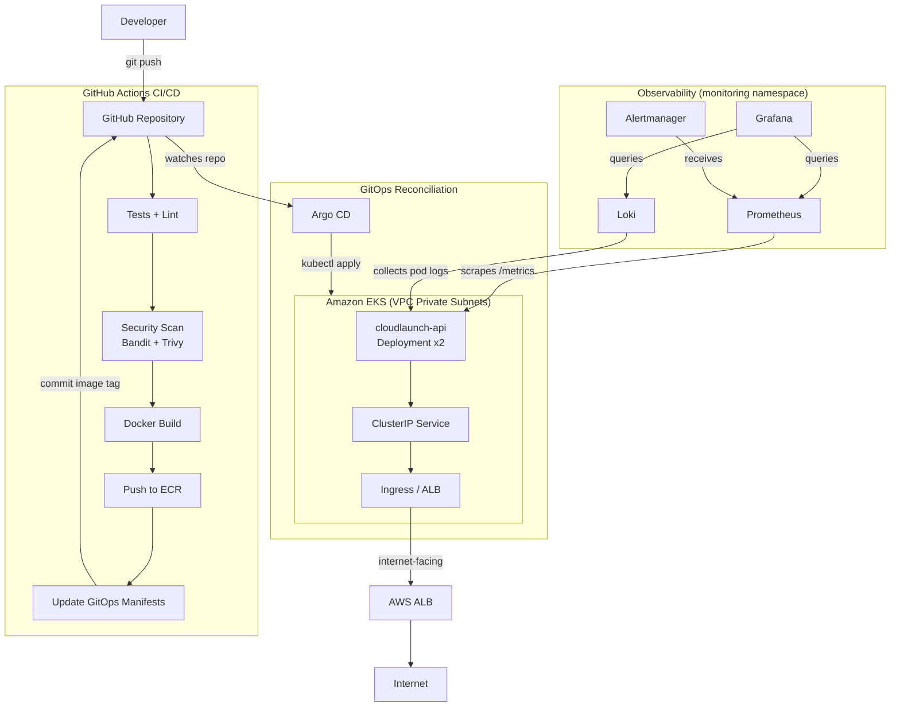

# CloudLaunch — Production-Style AWS EKS GitOps Lab

> A portfolio-grade DevOps/SRE platform demonstrating AWS EKS, Terraform, GitHub Actions CI/CD, Argo CD GitOps, observability, and controlled failure injection with rollback.

[](https://github.com/sayaksatpathi/AWS-EKS-GitOps-Production-Lab-/actions/workflows/ci.yml)
[](https://github.com/sayaksatpathi/AWS-EKS-GitOps-Production-Lab-/actions/workflows/docker.yml)
[](https://github.com/sayaksatpathi/AWS-EKS-GitOps-Production-Lab-/actions/workflows/terraform.yml)

---

## What This Demonstrates

I provisioned and operated an AWS EKS environment with Terraform, implemented GitHub Actions CI with security scanning, published container images to ECR using GitHub OIDC (no long-lived keys), deployed applications through Argo CD GitOps, exposed them through an AWS Application Load Balancer, instrumented metrics and logs with Prometheus/Grafana/Loki, and demonstrated a failed deployment followed by rollback and recovery — all using real infrastructure.

---

## Architecture



---

## Technology Stack

| Layer | Technology |
|-------|------------|
| Cloud | AWS (EKS, ECR, VPC, ALB, IAM) |
| Infrastructure as Code | Terraform 1.8 |
| Container Runtime | Docker (multi-stage, non-root) |
| Orchestration | Kubernetes 1.30 (Amazon EKS) |
| GitOps | Argo CD |
| CI/CD | GitHub Actions |
| Registry | Amazon ECR (immutable tags, scan on push) |
| Ingress | AWS Load Balancer Controller (ALB) |
| Metrics | Prometheus + kube-prometheus-stack |
| Dashboards | Grafana |
| Logs | Loki + Promtail |
| Alerting | Alertmanager |
| Auth | GitHub OIDC → AWS IAM (no long-lived keys) |
| SAST | Bandit + Semgrep |
| Image Scanning | Trivy + ECR Inspector |
| Manifest Validation | kubeconform |
| Kustomize | Overlays for environment configuration |

---

## Repository Structure

```
AWS-EKS-GitOps-Production-Lab-/
├── app/                          # Application source code
│   ├── src/main.py               # Flask API with /health /ready /metrics
│   ├── tests/test_app.py         # pytest unit + endpoint tests
│   ├── Dockerfile                # Multi-stage, non-root
│   └── requirements.txt
│
├── terraform/                    # Infrastructure as Code
│   ├── modules/
│   │   ├── vpc/                  # VPC, subnets, NAT, routing
│   │   ├── eks/                  # EKS cluster, node group, OIDC
│   │   ├── ecr/                  # ECR repository with lifecycle policy
│   │   └── iam/                  # GitHub OIDC role, ALB controller role
│   └── environments/dev/         # Dev environment configuration
│
├── gitops/                       # GitOps manifests (Argo CD source of truth)
│   ├── base/                     # Environment-agnostic Kubernetes manifests
│   ├── overlays/dev/             # Dev-specific overrides (image tag updated by CI)
│   └── argocd/                   # Argo CD Application and Project CRs
│
├── monitoring/
│   ├── dashboards/               # Grafana dashboard JSON
│   └── alerts/                   # PrometheusRule (alerting rules)
│
├── scripts/
│   ├── verify-infra.sh           # Verify AWS infrastructure
│   ├── verify-app.sh             # Verify Kubernetes workloads
│   ├── verify-gitops.sh          # Verify Argo CD state
│   ├── rollback.sh               # Trigger GitOps rollback
│   └── cleanup.sh                # Destroy all AWS resources
│
├── docs/                         # Documentation
│   ├── architecture.md
│   ├── deployment.md
│   ├── gitops.md
│   ├── observability.md
│   ├── failure-and-rollback.md
│   ├── security.md
│   └── troubleshooting.md
│
├── .github/workflows/
│   ├── ci.yml                    # Tests + lint + K8s validation + Terraform validate
│   ├── docker.yml                # Build + scan + push to ECR + GitOps update
│   └── terraform.yml             # Terraform fmt + validate + plan on PR
│
├── screenshots/                  # Evidence from deployed system
├── Makefile                      # Convenience targets
└── README.md
```

---

## Deployment Flow

```
git push
    │
    ▼
GitHub Actions CI
    ├── pytest (unit tests)
    ├── flake8 (linting)
    ├── kubeconform (manifest validation)
    ├── terraform fmt + validate
    ├── bandit (Python SAST)
    ├── semgrep (secrets + SAST)
    ├── docker build
    ├── trivy (container scan)
    ├── docker push → ECR (sha-<commit> tag)
    └── git commit: update gitops/overlays/dev/kustomization.yaml
            │
            ▼
    Argo CD detects change in gitops/ path
            │
            ▼
    Argo CD renders: kustomize build gitops/overlays/dev
            │
            ▼
    Argo CD applies diff to EKS cluster
            │
            ▼
    Kubernetes rolling update (maxUnavailable=0)
            │
            ▼
    Readiness probes pass → pods become Ready
            │
            ▼
    Service routes traffic → ALB health checks pass
            │
            ▼
    Argo CD: Synced + Healthy ✓
```

---

## AWS Infrastructure

Managed by Terraform in `terraform/environments/dev/`:

| Resource | Details | Cost Driver |
|----------|---------|------------|
| VPC | 10.0.0.0/16, 2 AZs | Free |
| Public Subnets | 2x (ALB lives here) | Free |
| Private Subnets | 2x (nodes live here) | Free |
| Internet Gateway | VPC internet access | Free |
| NAT Gateway | Private subnet egress | ~$32/month |
| EKS Cluster | Kubernetes 1.30 control plane | ~$73/month |
| EKS Node Group | 2x t3.medium | ~$60/month |
| ECR Repository | Image storage | ~$0.10/GB/month |
| ALB | Application Load Balancer | ~$16/month |

**Estimated cost: ~$180/month** when running continuously.
Use `make infra-down` to destroy when not in use.

---

## GitHub Actions Setup

The only secret required:

| Secret | Value | How to get |
|--------|-------|-----------|
| `AWS_ROLE_ARN` | `arn:aws:iam::<account>:role/cloudlaunch-dev-github-actions` | `terraform output github_actions_role_arn` |

No AWS access keys are stored — authentication uses GitHub OIDC.

---

## CI/CD Pipeline

### ci.yml — runs on every push
- Application unit tests (pytest)
- Python linting (flake8)
- Kubernetes manifest validation (kubeconform)
- Terraform format check
- Terraform validation (no-backend)
- Python SAST (Bandit)
- SAST (Semgrep)

### docker.yml — runs on push to main / git tags
- AWS authentication via OIDC
- Docker build (multi-stage)
- Trivy container vulnerability scan
- Push to ECR with `sha-<commit>` tag (or `v*` for releases)
- Update `gitops/overlays/dev/kustomization.yaml` with new image tag
- Commit and push GitOps update

### terraform.yml — runs on terraform/ changes
- Terraform format check
- Terraform validate (no-backend)
- Terraform plan (on PR, posts plan as comment)

---

## GitOps Design

**Why Argo CD and not `kubectl apply` from GitHub Actions?**

GitHub Actions only pushes an image to ECR and updates the image tag in a
YAML file in the repository. It does **not** run `kubectl`. Argo CD continuously
watches the repository and is the only entity that applies Kubernetes state.

This separation means:
- The cluster state is always traceable to a git commit
- Rollback means reverting a git commit — no special runbook required
- Drift (manual `kubectl` changes) is automatically detected and corrected
- The deployment history is in git, not in CI logs

See [docs/gitops.md](docs/gitops.md) for full explanation.

---

## Observability

After deployment, access dashboards:

```bash
# Grafana (admin/admin123)
make grafana
# → http://localhost:3000

# Prometheus
make prometheus
# → http://localhost:9090

# Argo CD UI
make argocd
# → http://localhost:8080 (user: admin)
```

Import `monitoring/dashboards/cloudlaunch-dashboard.json` into Grafana to see:
- Request rate and latency per endpoint
- Error rate
- Pod count and readiness
- Memory usage per pod

Alerts in `monitoring/alerts/cloudlaunch-alerts.yaml` fire on:
- >5% error rate
- Zero ready pods
- p95 latency > 1s
- Pod restarting > 3 times in 15m
- Deployment <50% available replicas

---

## Failure and Rollback Demo

### Trigger Failure

```bash
# Edit gitops/base/configmap.yaml
# Set: FAIL_READY: "true"
git add gitops/
git commit -m "demo: inject readiness failure (v2.0.0-bad)"
git push
```

**What happens:** Argo CD syncs the change. New pods start but fail readiness
probes (HTTP 503 on `/ready`). The rolling update stalls — old pods continue
serving. Argo CD reports "Degraded". Prometheus alert fires.

### Observe

```bash
kubectl get pods -n cloudlaunch
# cloudlaunch-api-new-xxx   0/1   Running   0   1m   ← stuck
# cloudlaunch-api-old-aaa   1/1   Running   0   20m  ← still serving

kubectl get application cloudlaunch-api -n argocd
# STATUS: Synced  HEALTH: Degraded
```

### Rollback

```bash
make rollback TAG=1.0.0
# Updates gitops/overlays/dev/kustomization.yaml
# Commits and pushes
# Argo CD detects and reconciles
```

**What happens:** Argo CD applies the reverted manifest. New pods with
`FAIL_READY=false` become ready. Old stuck pods are replaced. Service returns
to fully healthy state.

Full procedure: [docs/failure-and-rollback.md](docs/failure-and-rollback.md)

---

## Security Highlights

- **No long-lived AWS keys** in GitHub Actions — OIDC only
- **Containers run as non-root** (UID 1000, `allowPrivilegeEscalation: false`)
- **ReadOnly root filesystem** in all containers
- **IAM least privilege** — each role has only the permissions it needs
- **ECR image scanning** on every push
- **Trivy** container scan in CI
- **Bandit** and **Semgrep** SAST on every commit
- **Private subnets** for worker nodes
- **Secret scanning** via GitHub push protection

Full details: [docs/security.md](docs/security.md)

---

## Verification Commands

```bash
# Infrastructure
bash scripts/verify-infra.sh
# Expected: all checks green

# Application
bash scripts/verify-app.sh
# Expected: pods running, /health and /ready return 200

# GitOps
bash scripts/verify-gitops.sh
# Expected: STATUS=Synced  HEALTH=Healthy

# Quick kubectl check
kubectl get pods,svc,ingress -n cloudlaunch
kubectl get application cloudlaunch-api -n argocd

# Hit the application
ALB=$(kubectl get ingress cloudlaunch-api -n cloudlaunch \
  -o jsonpath='{.status.loadBalancer.ingress[0].hostname}')
curl http://$ALB/
curl http://$ALB/health
curl http://$ALB/metrics | grep cloudlaunch
```

---

## Cost Management

Major ongoing costs when deployed:
- NAT Gateway: ~$32/month
- EKS control plane: ~$73/month
- EC2 (2x t3.medium): ~$60/month
- ALB: ~$16/month

**Tear down when not in use:**
```bash
make infra-down
# or
bash scripts/cleanup.sh
```

---

## Cleanup

```bash
# Step 1: Remove Kubernetes resources (Ingress triggers ALB deletion)
kubectl delete ingress --all -n cloudlaunch

# Step 2: Wait ~60s for ALB deletion
sleep 60

# Step 3: Destroy Terraform infrastructure
cd terraform/environments/dev
terraform destroy -auto-approve

# Step 4: Verify no resources remain
aws ec2 describe-vpcs --filters "Name=tag:Project,Values=cloudlaunch"
aws eks list-clusters
aws ecr describe-repositories
```

---

## Documentation

| Document | Description |
|----------|-------------|
| [Architecture](docs/architecture.md) | Full architecture walkthrough with diagrams |
| [Deployment](docs/deployment.md) | Step-by-step deployment guide |
| [GitOps](docs/gitops.md) | Argo CD GitOps model and directory structure |
| [Observability](docs/observability.md) | Metrics, dashboards, alerts, and log queries |
| [Failure & Rollback](docs/failure-and-rollback.md) | Controlled failure and rollback procedure |
| [Security](docs/security.md) | OIDC, IAM, RBAC, image scanning |
| [Troubleshooting](docs/troubleshooting.md) | Common issues and diagnostic commands |

---

## Lessons Learned

1. **GitOps creates an auditable deployment history** — every deployment maps to a git commit, making rollbacks mechanical rather than heroic.

2. **OIDC for GitHub Actions is strictly better than access keys** — shorter credential lifetime, no rotation overhead, auditable trust policy.

3. **maxUnavailable: 0 is essential for safe bad-version demos** — without it, a bad deployment would drop traffic. With it, old pods serve until new ones are ready.

4. **Readiness vs liveness probes have different failure modes** — readiness failure gates traffic routing without killing the pod; liveness failure triggers restart. The demo uses readiness to show a "stuck" deployment rather than a crashloop.

5. **One NAT Gateway is sufficient for dev** — two would improve AZ resilience but doubles cost (~$32/month extra) for a learning environment.

6. **t3.medium is the minimum practical EKS node size** — t3.small struggles with the Prometheus/Grafana/Loki stack overhead.

---

*Built by Sayak Satpathi — [github.com/sayaksatpathi](https://github.com/sayaksatpathi)*
